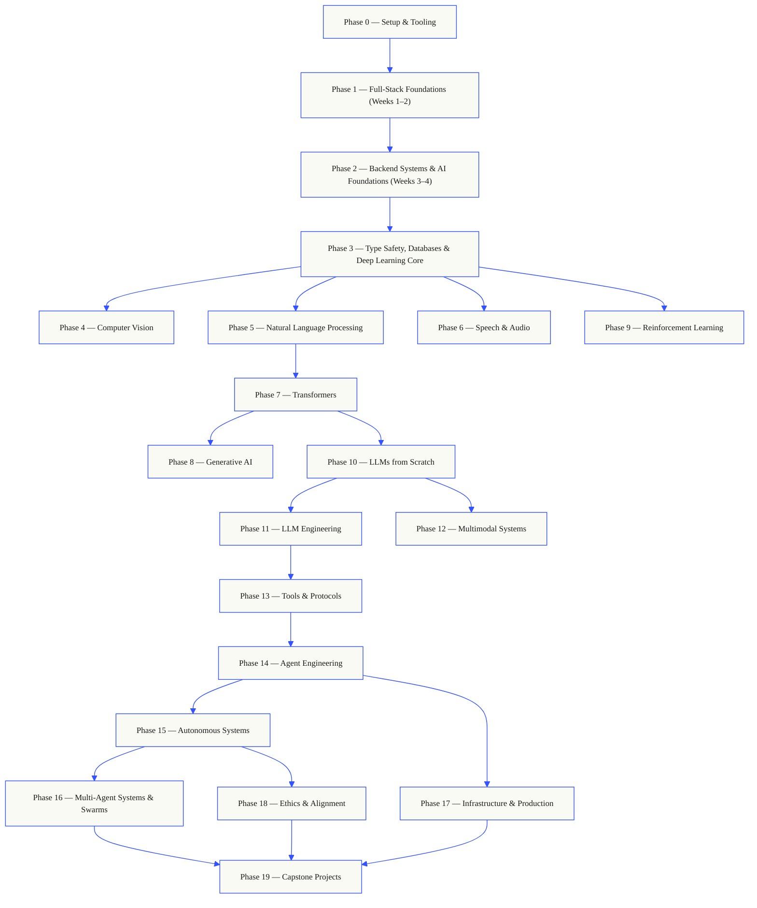

# ENGINEER FROM SCRATCH.

**Full-Stack & AI Engineering Learning Platform**


A highly optimized, minimal Single Page Application (SPA) designed as a personal learning engine. It tracks progress through a rigorous 24-week dual-track bootcamp covering distributed systems and applied Artificial Intelligence. 


## ⚙️ The Engine

Built from first principles to ensure maximum performance and absolute privacy:

- **Zero Frameworks:** Pure HTML5, CSS3, and Vanilla JavaScript.

- **Zero Backend:** All state (progress, bookmarks, personal notes) relies entirely on the browser's `localStorage`.

- **Data-Driven:** The entire curriculum is dynamically rendered from local `.json` files.


## 📚 The Curriculum Philosophy

The protocol enforces a backend-first philosophy. The first two weeks are dedicated exclusively to mastering foundational web primitives, Node.js, and server-side execution. From Week 3 onward, the curriculum bifurcates. Track A (Full-Stack Engineering) remains the primary trunk, focusing on strict typing, distributed databases, and containerized infrastructure. Track B (AI/ML Engineering) runs in parallel, diving into neural mathematics, self-attention mechanisms, and autonomous agents. The two tracks converge into enterprise-grade capstone architectures.


- **Track A (Full-Stack Engineering):** Focuses on API design, PostgreSQL databases, strict typing (TypeScript), modern client architectures (React/Next.js), and containerized infrastructure (Docker, Kubernetes).

- **Track B (AI/ML Engineering):** Focuses on neural network mathematics, Transformers, RAG systems, autonomous AI agents (LangGraph), and high-throughput inference (vLLM).


## 🗺️ The Shape of the Curriculum


The curriculum is layered and structurally favors backend engineering as the necessary trunk from which all specialized AI domains branch. After mastering core distributed systems and deep learning fundamentals, learners diverge into specific tracks—ranging from NLP and Computer Vision to Autonomous Swarms—before converging at the final production capstones.





## 🚀 Local Execution


Because the application uses ES6 modules and the `fetch()` API for JSON data, it must be run through a local web server to bypass strict CORS restrictions. Do not open `index.html` directly.


**Using Node.js:**

```bash

npx serve .

```


**Using Python:**

```bash

python3 -m http.server 8000

```

Then navigate to `http://localhost:8000` or the port provided by your terminal.


## 🔒 Data & State Management


Your progress is yours. All tracking data, week-level bookmarks, and markdown notes are saved locally on your device. Navigate to the **Settings** module within the platform to manually export your progress as a `.json` backup file before clearing browser data or switching devices.


## 🛠️ Fork & Customize (Open Source)


This tracker is designed to be fully agnostic. You can replace the entire curriculum with your own:


1. Fork this repository.

2. Open the `data/fullstack.json` or `data/aiml.json` files.

3. Replace the stages, weeks, concepts, and micro-projects with your own structured learning path.

4. The UI will automatically parse the JSON and completely rebuild the visual roadmap, checkbox tracking logic, and progress bars.


## 🌐 Deployment


This application is 100% static and can be deployed for free in seconds:


* **GitHub Pages:** Go to repository Settings -> Pages, and select the `main` branch.

* **Vercel / Netlify:** Import the repository directly (leave all build commands empty).

